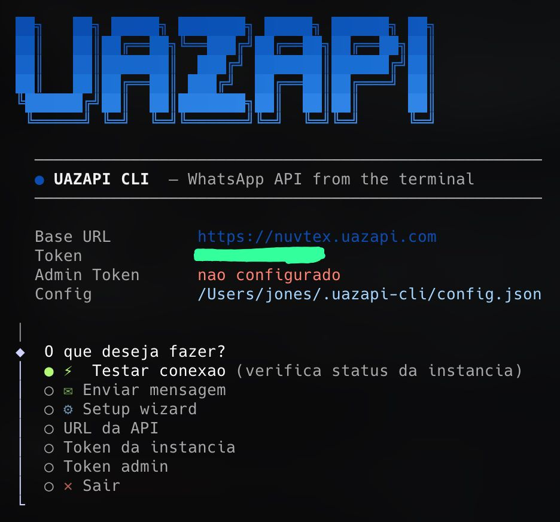

# uazapi-cli

> **Aviso:** Esta es una herramienta **no oficial**, creada por la comunidad. **No tiene ningun vinculo, respaldo ni asociacion con UAZAPI.** Usela bajo su propia responsabilidad.

**[Portugues](README.md) | [English](README.en.md)**

Una interfaz de linea de comandos para la API de WhatsApp de [UAZAPI](https://uazapi.com). Administre su instancia, envie mensajes, gestione grupos, contactos, webhooks y mucho mas — todo desde la terminal.

## El problema

UAZAPI expone una API REST poderosa con mas de 128 endpoints para automatizacion de WhatsApp. Pero interactuar con ella significa lidiar con comandos `curl`, recordar paths de endpoints, armar payloads JSON y manejar headers de autenticacion manualmente.

**uazapi-cli** encapsula toda la superficie de UAZAPI en un unico binario con:

- Un **menu interactivo** para operaciones rapidas (probar conexion, enviar mensaje, listar instancias)
- Una **CLI completa** con subcomandos para scripts y automatizacion (`uazapi send text --to 5411... --message "hola"`)
- Un **wizard de configuracion** que guarda la URL y el token de la instancia una sola vez
- **Auto-actualizacion** integrada — ejecute `uazapi update` en cualquier momento

No mas copiar y pegar tokens en headers o consultar la documentacion en cada request.



## Instalacion

Un solo comando:

```bash
curl -fsSL https://raw.githubusercontent.com/jonesfernandess/uazapi-cli/main/install.sh | bash
```

El script verifica Node.js 18+ y npm, clona el repositorio en `~/.uazapi-cli-app`, compila e instala el comando `uazapi` globalmente.

**Requisitos:** Node.js 18+, npm, git.

## Inicio rapido

```bash
# 1. Instalar
curl -fsSL https://raw.githubusercontent.com/jonesfernandess/uazapi-cli/main/install.sh | bash

# 2. Configurar — abre el wizard de setup
uazapi setup

# 3. Probar la conexion
uazapi instance status

# 4. Enviar su primer mensaje
uazapi send text --to 5411999999999 --message "Hola desde la terminal!"
```

O simplemente ejecute `uazapi` sin argumentos para abrir el menu interactivo.

## Actualizacion

Actualice a la version mas reciente en cualquier momento:

```bash
uazapi update
```

`uazapi upgrade` tambien funciona. El comando descarga el codigo mas reciente de GitHub, reinstala dependencias y recompila automaticamente.

## Uso

### Modo interactivo

Ejecute `uazapi` sin argumentos:

```
  UAZAPI CLI — WhatsApp API from the terminal

  ● Que desea hacer?
  ● ⚡ Probar conexion      (verifica status de la instancia)
  ○ ☰  Listar instancias    (todas las instancias de la API)
  ○ ✉  Enviar mensaje       (envio rapido de texto)
  ○ ⚙  Setup wizard
  ○ ✕  Salir
```

### Modo CLI

Para scripts y automatizacion:

```
uazapi [comando] [subcomando] [opciones]
```

### Comandos

| Comando | Descripcion |
|---------|-------------|
| `instance` | Administrar instancia WhatsApp (conectar, desconectar, status, reset) |
| `send` | Enviar mensajes (texto, media, ubicacion, contacto, carrusel, encuesta, boton PIX) |
| `message` | Administrar mensajes (buscar, eliminar, descargar, editar, reaccionar) |
| `chat` | Administrar conversaciones (buscar, archivar, bloquear, eliminar, silenciar, fijar) |
| `group` | Administrar grupos de WhatsApp |
| `contact` | Administrar contactos |
| `webhook` | Administrar webhooks |
| `newsletter` | Administrar Canales/Newsletters de WhatsApp |
| `business` | Perfil comercial y catalogo |
| `sender` | Envio masivo |
| `admin` | Operaciones administrativas (requiere token admin) |
| `label` | Administrar etiquetas |
| `profile` | Administrar perfil de WhatsApp |
| `setup` | Wizard de configuracion |
| `update` | Actualizar a la version mas reciente |

### Ejemplos

```bash
# Verificar status de la instancia
uazapi instance status

# Enviar mensaje de texto
uazapi send text --to 5411999999999 --message "Hola!"

# Enviar imagen
uazapi send media --to 5411999999999 --type image --file https://ejemplo.com/foto.jpg

# Enviar boton de pago PIX
uazapi send pix-button --to 5411999999999 --key "su-clave-pix" --amount 49.90

# Publicar un Story en WhatsApp
uazapi send status --type text --message "Novedad!"

# Configurar webhook
uazapi webhook set --url https://su-servidor.com/webhook

# Listar todos los grupos
uazapi group list

# Ayuda de cualquier comando
uazapi send --help
uazapi instance connect --help
```

## Configuracion

En la primera ejecucion, el wizard crea `~/.uazapi-cli/config.json`:

```json
{
  "baseUrl": "https://su-instancia.uazapi.com",
  "token": "su-token-de-instancia",
  "adminToken": ""
}
```

| Campo | Descripcion |
|-------|-------------|
| `baseUrl` | URL de su instancia UAZAPI |
| `token` | Token de autenticacion de la instancia |
| `adminToken` | Token admin (opcional, para listar instancias y operaciones admin) |

Puede reconfigurar en cualquier momento con `uazapi setup` o cambiar valores individuales desde el menu interactivo.

## Build local

```bash
git clone https://github.com/jonesfernandess/uazapi-cli.git
cd uazapi-cli
npm install
npm run build
npm install -g .
```

### Desarrollo

```bash
npm run dev      # Ejecutar con tsx (sin build)
npm run build    # Compilar TypeScript a dist/
npm run lint     # Verificar tipos sin emitir archivos
```

## Stack

- **TypeScript** + **Commander.js** para el framework CLI
- **@clack/prompts** para el menu interactivo
- **chalk** + **gradient-string** + **figlet** para estilos en la terminal

## Licencia

MIT
